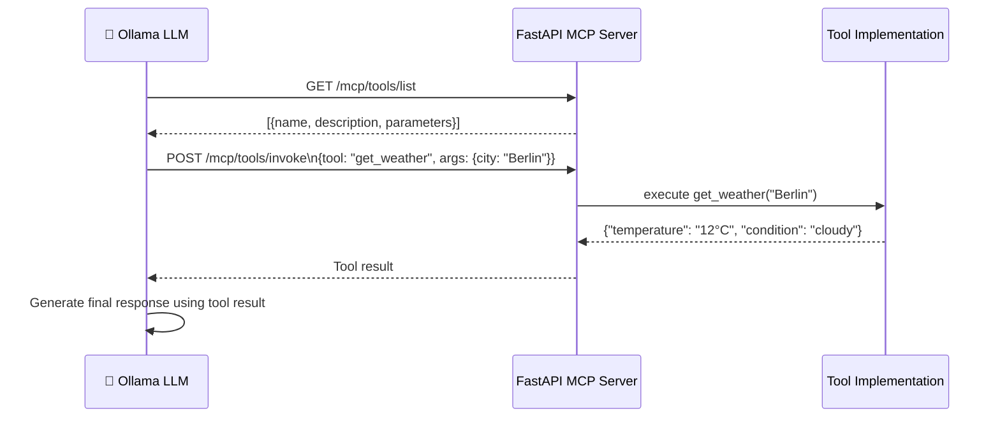

# MCP + FastAPI + Ollama 🧠🚀

<p align="center">
  
  
  
  
  
  
</p>

A minimal **FastAPI backend that exposes tools to local LLMs** using the [Model Context Protocol (MCP)](https://modelcontextprotocol.org). Connect any MCP-compatible LLM (LLaMA 3 via Ollama, Claude, etc.) to your tools with a clean REST API.

---

## ✨ Features

- [x] FastAPI backend with MCP-compatible endpoints
- [x] Tool listing: `GET /mcp/tools/list`
- [x] Tool invocation: `POST /mcp/tools/invoke`
- [x] Example tool: `get_weather(city)`
- [x] Works with Ollama and any LLM supporting tool calling
- [x] Easy to extend — add new tools in minutes

---

## 🏗️ How It Works



---

## 🚀 Quick Start

```bash
git clone https://github.com/ahmadalsharef994/llm-mcp-fastapi.git
cd llm-mcp-fastapi

python3 -m venv venv && source venv/bin/activate
pip install -r requirements.txt

# Start Ollama (in a separate terminal)
ollama serve
ollama pull llama3.2

# Start the MCP server
uvicorn app.main:app --reload
```

---

## 🔌 API

### List available tools
```bash
curl http://localhost:8000/mcp/tools/list
```

```json
[
  {
    "name": "get_weather",
    "description": "Get current weather for a city",
    "parameters": {
      "city": {"type": "string", "required": true}
    }
  }
]
```

### Invoke a tool
```bash
curl -X POST http://localhost:8000/mcp/tools/invoke \
  -H "Content-Type: application/json" \
  -d '{"tool": "get_weather", "args": {"city": "Berlin"}}'
```

### Chat with tool-calling
```bash
curl -X POST http://localhost:8000/chat \
  -H "Content-Type: application/json" \
  -d '{"message": "What is the weather in Berlin?"}'
```

---

## 🛠️ Adding New Tools

```python
# app/tools/my_tool.py
def my_tool(param: str) -> dict:
    return {"result": f"processed {param}"}

# Register in app/main.py
tools.register("my_tool", my_tool, description="Does something useful")
```

---

## 📁 Project Structure

```
app/
├── main.py           # FastAPI app + MCP endpoints
├── tools/            # Tool implementations
│   └── weather.py    # Example weather tool
└── ollama_config/    # Ollama model settings
```

---

## 📄 License

MIT
